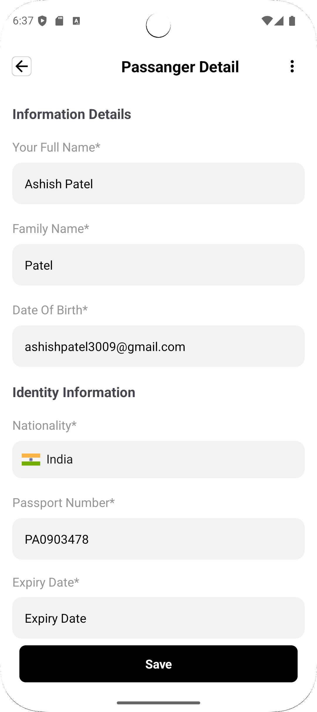
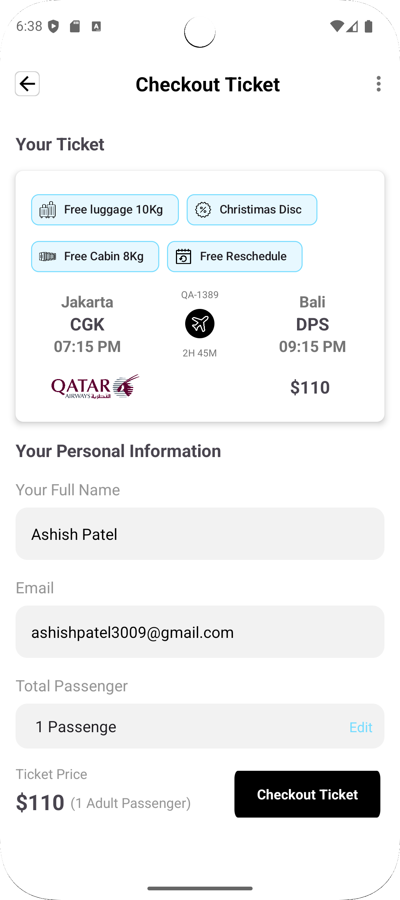
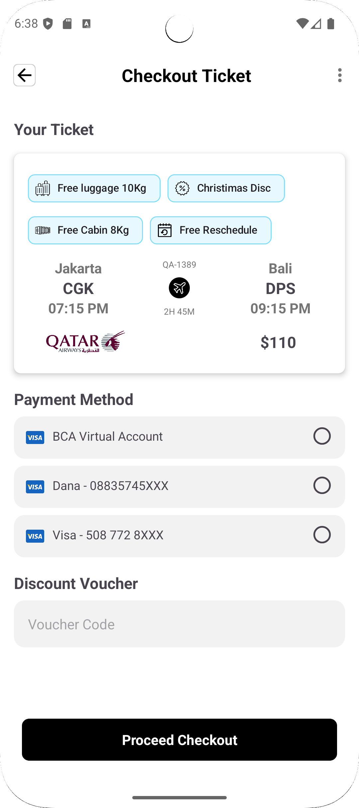

# Travel Mobile App - Flight Checkout Layout

This repository contains the layout for the **Flight Checkout** screen of a travel mobile application built with **Android Native** using **Kotlin** and **XML**. The layout allows users to review flight details, enter passenger information, select payment options, and confirm their bookings. It is fully optimized for Android devices and designed to offer a seamless, user-friendly experience.

---

## Features

- **Flight Summary**: Displays essential flight details, including departure/arrival times, flight number, and airline.
- **Passenger Information**: A form for entering passenger details like name, contact, and passport number.
- **Payment Integration**: Payment method selection section (credit/debit card, PayPal, etc.).
- **Review & Confirmation**: A final overview screen to confirm all booking details before completing the purchase.
- **Responsive Design**: Optimized for various Android screen sizes and resolutions.
- **Real-time Validation**: Form validation to ensure all required fields are correctly filled before proceeding.

---

## Screenshots

Here are some screenshots of the Flight Checkout layout:

---

## Tech Stack

- **Android Native** (Java/Kotlin)
- **Kotlin** for app logic and functionality
- **XML** for UI layout
- **Android SDK** for native components

---
